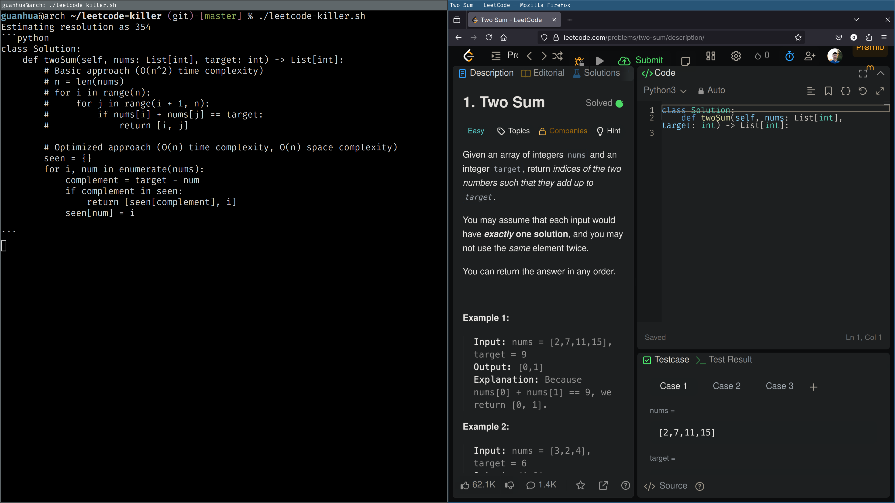

# leetcode-killer

a script to take screenshot of current focused window -> ocr -> llm

llm can handle most of the algorithm. but llm sometimes fail to debug multi-thread system programming, so i guess llm don't understand critical section

leetcode problem only have limited symbols, which means short markov chain - easy meal for llm

## demo



## usage

```sh
guanhua@arch ~/leetcode-killer (git)-[master] % ./leetcode-killer.sh --lang <lang>
```

## dep
- arch linux
- wayland
- sway
- swaymsg
- grim
- jq
- tesseract
- shell_gpt

## tips
- human can't compete with machine in short markov chain
- [A Mathematical Theory of Communication](https://en.wikipedia.org/wiki/A_Mathematical_Theory_of_Communication)
